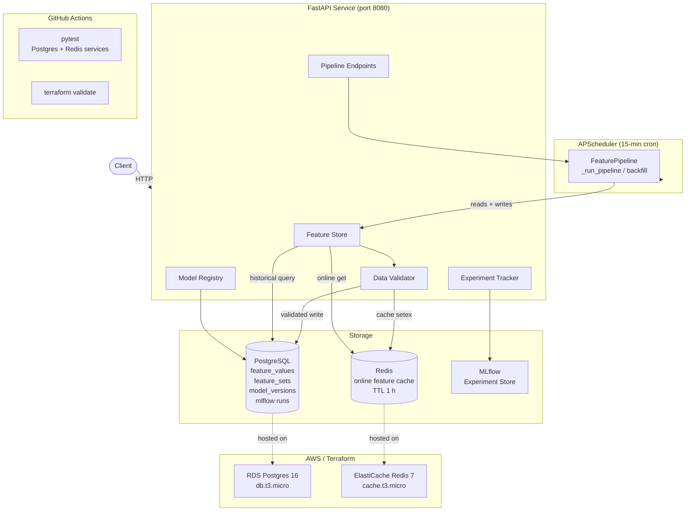

# ML Platform: Feature Store + Experiment Tracking

[](https://github.com/matthew-fitzgerald123/ml-platform/actions/workflows/ci.yml)


A production-ready ML platform exposing a schema-validated feature store, MLflow experiment tracking, a model registry with stage promotion, and a scheduled feature pipeline, all through a single FastAPI service backed by PostgreSQL and Redis.

## Architecture



## Stack

| Component | Library / Service |
|---|---|
| API | FastAPI + uvicorn |
| Online feature cache | Redis (ElastiCache in AWS) |
| Offline store + model registry | PostgreSQL + SQLAlchemy (RDS in AWS) |
| Experiment tracking | MLflow |
| Scheduled pipeline | APScheduler (AsyncIOScheduler, 15-min cron) |
| Data validation | Schema-typed feature validator (type + null + range) |
| Infra | Terraform: VPC, RDS, ElastiCache |
| CI | GitHub Actions: pytest + terraform validate |

## Setup

Requires Python 3.11, PostgreSQL, and Redis running locally.

```bash
createdb mlplatform
make install
brew services start redis
```

## Running

```bash
make serve      # FastAPI at http://localhost:8080
make mlflow-ui  # MLflow UI (separate terminal)
make demo       # end-to-end demo
make test       # run test suite
```

## API Reference

### Feature Store

| Method | Path | Description |
|---|---|---|
| POST | `/features/register` | Register a feature set with typed schema |
| POST | `/features/write` | Write features (validated against schema) |
| GET | `/features/{set}/{entity_id}` | Online lookup via Redis |
| GET | `/features/{set}/history` | Historical lookup via Postgres |
| GET | `/features` | List all feature sets |

### Experiment Tracking

| Method | Path | Description |
|---|---|---|
| POST | `/experiments/run` | Start an MLflow run |
| POST | `/experiments/metrics` | Log metrics to a run |
| POST | `/experiments/finish/{run_id}` | Mark a run complete |
| GET | `/experiments/{name}/best` | Best run by metric |
| GET | `/experiments/{name}/runs` | List runs for an experiment |

### Model Registry

| Method | Path | Description |
|---|---|---|
| POST | `/models/register` | Register a model version with artifact URI and metrics |
| GET | `/models/{name}/versions` | List all versions for a model |
| POST | `/models/{name}/promote` | Promote a version to staging / production / archived |
| GET | `/models/{name}/production` | Get the current production version |

### Feature Pipeline

| Method | Path | Description |
|---|---|---|
| GET | `/pipeline/status` | Scheduler state, last run, next run |
| POST | `/pipeline/run` | Trigger an immediate pipeline run |
| POST | `/pipeline/backfill` | Replay derived feature computation over a date range |

Interactive docs at `http://localhost:8080/docs`.

## Data Validation

Feature schemas support typed fields with optional numeric range bounds:

```json
{
  "credit_score": "int:300:850",
  "debt_to_income": "float:0:2",
  "employment_status": "str"
}
```

Writes that fail type checks, range bounds, or contain null required fields are rejected with a `422` response listing all violations.

## Project Structure

```
app/
  main.py               FastAPI app, lifespan, all routes
  feature_store.py      Redis online store + Postgres historical store
  validator.py          Schema type, null, and range validation
  experiment_tracker.py MLflow run management
  model_registry.py     Model versioning and stage promotion
  scheduler.py          APScheduler pipeline (cron + backfill)
  models.py             SQLAlchemy ORM models
  database.py           Engine and session factory
infra/
  main.tf               VPC, RDS, ElastiCache resources
  variables.tf          Input variables
  outputs.tf            Connection endpoint outputs
  example.tfvars        Variable defaults template
.github/workflows/
  ci.yml                Test + terraform validate on push/PR
notebooks/
  demo.py               End-to-end feature write + experiment demo
tests/
  test_platform.py      Integration tests (all features)
```

## Notes

- The feature store is consumed by the llm-agent project (`lookup_entity` tool)
- MLflow tracking server runs locally via `run_mlflow_ui.py`
- Redis keys are namespaced by feature set: `fs:{feature_set}:{entity_id}`
- The scheduled pipeline derives `risk_score`, `dti_band`, and `credit_tier` from raw financial signals every 15 minutes
